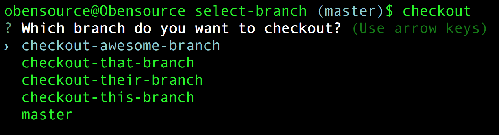

# select-branch

__A handy CLI tool for quickly checking out a local git branch.__

This exists so you don't have to keep copying & pasting the name of the branch you'd like to checkout when running $`git branch`

### Installation
Run $`npm install -g select-branch`

### Use
👉 Run $`checkout` anywhere to checkout a new branch.

👉 Choose which branch you'd like to checkout.

👉 Hit `return` again to confirm.

## 
##### License: [MIT](https://opensource.org/licenses/MIT)
